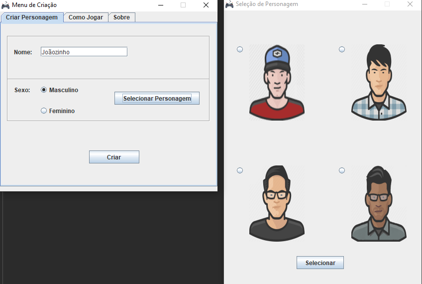
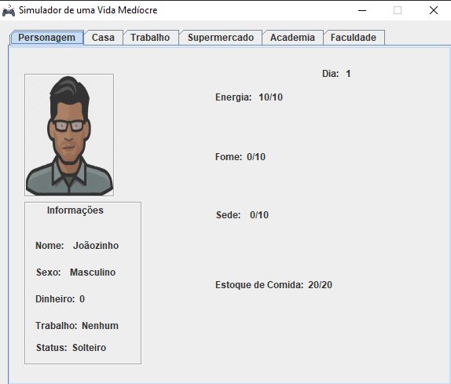

## :video_game: Simulador de Vida Medíocre
<h1 align ="center">
    </img>
    </img>
</h1>

## 💻 Sobre o projeto

> O projeto se define como um simples jogo de simulação de vida, onde é possível criar seu personagem e desenvolver sua história por meio de um sistema simples de escolhas.
> Sua interface gráfica foi desenvolvido no [NetBeans IDE 8.2 RC](https://netbeans.org/).

## 🛠 Tecnologia

- Java

## 🤖 Autora
- [Linkedin](https://www.linkedin.com/in/bkkater/)
- [Instagram](https://www.instagram.com/bkkater/)
